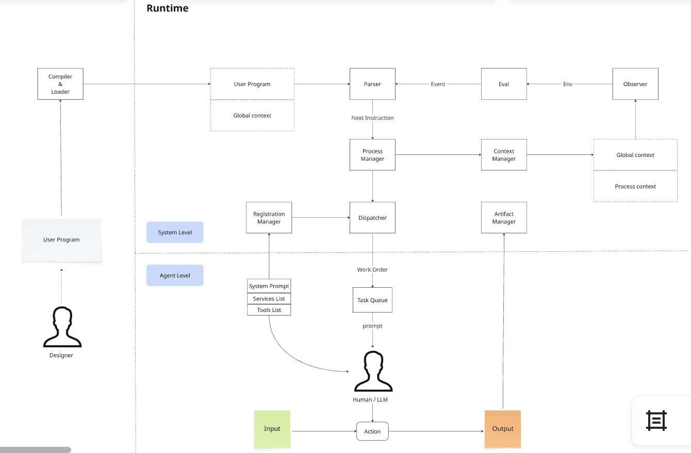

# AIDA — AI-Native 组织运营基础设施平台

> **AIDA**: Agile Intent-Driven Architecture（敏捷意图驱动架构）

AIDA 定义了一套通用的"业务虚拟机（Business Virtual Machine）"规范，使得业务蓝图本身即可被运行时引擎理解和执行，并能由 AI Agent 进行生成、部署、运营维护和操作使用。

核心理念：**业务流程即代码 (Business Process as Code)**

## 架构



## 组成

| 组件 | 说明 | 路径 |
|------|------|------|
| **BPS 规范** | 业务流程描述通用规范 v0.9 | `docs/` |
| **SBMP** | 标准业务建模过程 v0.2 | `docs/` |
| **BPS 引擎** | TypeScript 版 BPS 引擎 + Dashboard（OpenClaw 插件） | `src/` + `dashboard/` |
| **erpsys** | Django 版 BPS 引擎（参考实现） | `erpsys/` |

## 快速开始

```bash
git clone --recurse-submodules https://github.com/jinniudashu/aida.git
cd aida
npm install

# 运行全部测试（引擎 255 + Dashboard 112 = 367）
npx vitest run

# 启动 Dashboard 开发服务器
npm run dev:dashboard

# 构建 Dashboard
npm run build:dashboard
```

## 许可证

MIT
